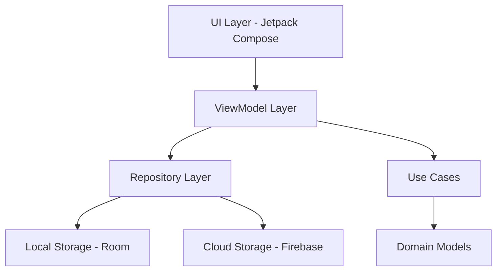

# 🌟 SyncWell - Health & Wellness Tracking App

<div align="center">


[](https://developer.android.com)
[](https://kotlinlang.org)
[](https://firebase.google.com)
[](https://developer.android.com/jetpack/compose)

[](LICENSE)
[](https://github.com/yourusername/syncwell/releases)
[](https://github.com/yourusername/syncwell/actions)
[](https://github.com/yourusername/syncwell/pulls)

*A comprehensive health and wellness tracking application designed to help users maintain a healthier lifestyle through intuitive task management, medication tracking, and wellness monitoring.*

[🚀 Features](#-features) • [📱 Screenshots](#-screenshots) • [🛠️ Installation](#️-installation) • [🏗️ Architecture](#️-architecture) • [🌐 Localization](#-localization) • [🤝 Contributing](#-contributing)

</div>

---

## 🚀 Features

### 🎯 **Health Task Management**
- ✅ Create and track health-related tasks with deadlines
- 📊 Importance levels and priority management
- 🔔 Customizable reminders and notifications
- ☁️ Synchronized storage between local and cloud

### 💊 **Medication Tracking**
- ⏰ Medicine schedules and automated reminders
- 📏 Precise dosage tracking
- 🔔 Smart notifications for medicine times
- 📱 Easy-to-use interface for medication management

### 📈 **Wellness Metrics Monitoring**
- 💧 **Water Intake**: Track daily hydration goals
- 😴 **Sleep Tracking**: Monitor sleep hours and quality
- 🚶 **Step Counter**: Daily activity and step goals
- 😊 **Mood & Energy**: Track emotional and energy levels
- 📝 **Personal Notes**: Add daily wellness observations

### 📊 **Interactive Dashboard**
- 🎨 Beautiful circular progress indicators
- 📱 Real-time wellness metrics display
- 📅 Daily, weekly, and monthly progress views
- 🎯 Goal tracking and achievement system

---

## 📱 Screenshots

<div align="center">

| Dashboard | Tasks | Wellness Tracking | Profile |
|:---------:|:-----:|:-----------------:|:-------:|
|  |  |  |  |

</div>

---

## 🛠️ Installation

### Prerequisites
- Android Studio Arctic Fox or later
- Kotlin 1.8.0+
- Android SDK 24+
- Firebase account

### Quick Start

1. **Clone the repository**
   ```bash
   git clone https://github.com/yourusername/syncwell.git
   cd syncwell
   ```

2. **Firebase Setup**
   - Create a new Firebase project
   - Add your Android app to the project
   - Download `google-services.json`
   - Place it in the `app/` directory

3. **Build and Run**
   ```bash
   ./gradlew build
   ./gradlew installDebug
   ```

---

## 🏗️ Architecture

<div align="center">



</div>

### 🎨 **UI Layer**
- **Jetpack Compose** with Material3 Design
- **MVVM** architecture pattern
- **State Management** with Compose State

### 🗄️ **Data Layer**
- **Room Database** for local persistence
- **Firebase Firestore** for cloud synchronization
- **Repository Pattern** for data abstraction

### 🔧 **Key Components**

#### Task Entity
```kotlin
@Entity(tableName = "tasks")
data class Task(
    @PrimaryKey @DocumentId
    val id: String = UUID.randomUUID().toString(),
    val userId: String = "",
    val title: String = "",
    val description: String = "",
    val completed: Boolean = false,
    val deadlineMillis: Long = 0,
    val importance: Int = 0,
    val lastModified: Long = System.currentTimeMillis()
)
```

#### Wellness Metrics
```kotlin
@Entity(tableName = "wellness_entries")
data class WellnessEntry(
    @PrimaryKey @DocumentId
    val id: String = UUID.randomUUID().toString(),
    val userId: String = "",
    val waterIntakeOz: Int = 0,
    val sleepHours: Float = 0f,
    val stepCount: Int = 0,
    val moodRating: Int = 0,
    val energyLevel: Int = 0,
    val notes: String = ""
)
```

---

## 🌐 Localization

SyncWell supports multiple languages with runtime language switching:

| Language | Code | Status |
|----------|------|---------|
| 🇺🇸 English | `en` | ✅ Complete |
| 🇪🇸 Spanish | `es` | ✅ Complete |
| 🇫🇷 French | `fr` | 🚧 In Progress |
| 🇩🇪 German | `de` | 🚧 In Progress |

### Language Implementation
```kotlin
private fun applySavedLanguage() {
    val prefs = getSharedPreferences("app_settings", Context.MODE_PRIVATE)
    val savedLanguage = prefs.getString(PREF_LANGUAGE, DEFAULT_LANGUAGE) ?: DEFAULT_LANGUAGE
    
    val locale = Locale(savedLanguage)
    Locale.setDefault(locale)
    
    val localeList = androidx.core.os.LocaleListCompat.forLanguageTags(savedLanguage)
    AppCompatDelegate.setApplicationLocales(localeList)
}
```

---

## 🛡️ Security & Privacy

- 🔐 **Firebase Authentication** with Google Sign-In
- 🔒 **Data Encryption** for sensitive health information
- 🏠 **Local-First Storage** with cloud backup
- 🛡️ **Privacy-Focused** - Your data stays yours

---

## ♿ Accessibility

SyncWell is built with accessibility in mind:

- 🗣️ **TalkBack Support** - Full screen reader compatibility
- 🔍 **Large Text Support** - Scalable fonts and UI elements
- 🌓 **High Contrast Mode** - Better visibility options
- 📱 **Semantic Navigation** - Clear, logical app flow

---

## 🚀 Technology Stack

<div align="center">

| Category | Technology | Version |
|----------|------------|---------|
| **Language** |  | 1.8.0+ |
| **UI Framework** |  | 1.4.0+ |
| **Architecture** |  | - |
| **Local DB** |  | 2.5.0+ |
| **Cloud DB** |  | 32.2.0+ |
| **DI** |  | 2.46+ |
| **Background Tasks** |  | 2.8.0+ |

</div>

---

## 📈 Performance

- ⚡ **Offline-First Architecture** - Works without internet
- 🔄 **Background Sync** - Automatic data synchronization
- 💾 **Efficient Caching** - 100MB local cache with Room
- 🎯 **Optimized Queries** - Fast data retrieval

---

## 🤝 Contributing

We welcome contributions! Here's how you can help:

### 🐛 Bug Reports
- Use the [issue tracker](https://github.com/yourusername/syncwell/issues)
- Include device info and steps to reproduce

### 💡 Feature Requests
- Check existing [feature requests](https://github.com/yourusername/syncwell/issues?q=label%3Aenhancement)
- Open a new issue with detailed description

### 🔧 Pull Requests
1. Fork the repository
2. Create a feature branch (`git checkout -b feature/amazing-feature`)
3. Commit changes (`git commit -m 'Add amazing feature'`)
4. Push to branch (`git push origin feature/amazing-feature`)
5. Open a Pull Request

### 📋 Development Guidelines
- Follow [Kotlin coding conventions](https://kotlinlang.org/docs/coding-conventions.html)
- Write tests for new features
- Update documentation as needed
- Ensure accessibility compliance

---

## 📄 License

This project is licensed under the MIT License - see the [LICENSE](LICENSE) file for details.

---

## 🙏 Acknowledgments

- **Material Design** - For beautiful UI components
- **Firebase Team** - For robust backend services
- **Android Team** - For amazing development tools
- **Open Source Community** - For inspiration and support

---

## 📞 Support

Having issues? We're here to help!

- 📧 **Email**: support@syncwell.app
- 🐛 **Bug Reports**: [GitHub Issues](https://github.com/yourusername/syncwell/issues)
- 💬 **Discussions**: [GitHub Discussions](https://github.com/yourusername/syncwell/discussions)
- 📖 **Documentation**: [Wiki](https://github.com/yourusername/syncwell/wiki)

---

<div align="center">

**Made with ❤️ by the SyncWell Team**

[](https://github.com/yourusername)
[](https://twitter.com/syncwell_app)

⭐ **Star this repo if you find it helpful!** ⭐

</div>
